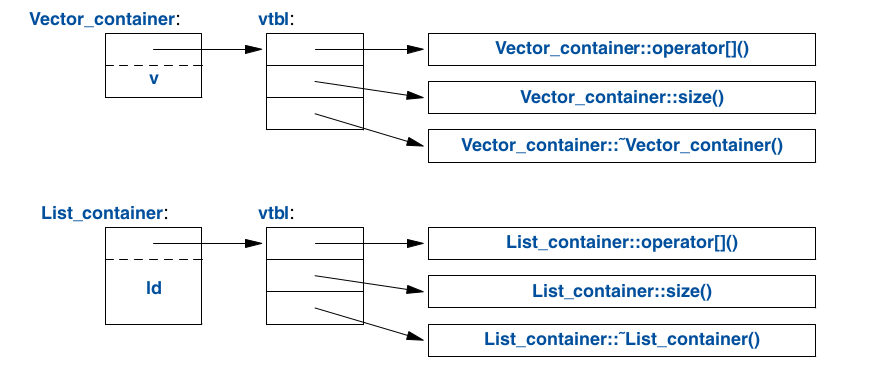
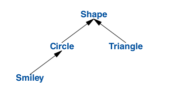

.. include:: ../../links.txt
.. include:: ../../roles.txt

.. _lec6_2:

.. contents:: Table of Contents
   :local:
   :depth: 1
   :backlinks: top

.. _lec6_class_review:

Classes
************************

In the last class, we presented some C++ language features that allow us to create our own user-defined types.  

We discussed the difference between the interface and implementation of our classes.
We showed how we can design easier and safer classes by creating a good interface for our classes.
Whenever possible, we should try to keep users from directly accessing the representation of types.
Data should only be accessed carefully designed members functions that ensure the validity of our objects.
These member functions should be guaranteed to generate objects with valid values and throw exceptions when
they are incorrect (remember invalid Dates). Finally, we discuss some of the features of a good class interface.
A good class interface should provide a few things.

- Provide Constructors that initialize our types with valid values.
- The interface should support or restrict copying.  
- We also keep our interface as minimal as possible.
- Not every function needs access to the representation
- Use types when possible to provide good argument checking for our member functions
- Identify all the nonmodifying member functions
- Provide meaningful operator overloaded functions that reflect how a user might expect to use an object.
- Provide a set of helper functions defined outside of class. 

FIn this class, we will show how we can use some of the language features presented in the last lecture to create 3 basic categories of types. 

- Concrete Types
- Abstract Types
- Classes in Class Hierarchies

Most classes that can be built can be categorized into these three fundamental types or variants of such.
Therefore, the techniques used to create these fundamental types can implement any other complicated type you wish to make. 

Concrete types
##########################

The basic idea of a concrete type is that they are a type that should behave just like the built-in types.
So, for example, when we wish to define a Complex number type, it should behave just like an int.  

.. literalinclude:: /lecture_code/classes2/concrete1.cc
    :language: cpp

On the other hand, we can also have vectors and strings, which behave just like arrays.
They are containers that hold data of a particular type, but they behave better.

.. literalinclude:: /lecture_code/classes2/concrete2.cc
    :language: cpp

The defining characteristic of a concrete type is that the representation is a part of the class definition.
We will demonstrate this with a few examples.  

Arithmetic Types
##########################

Here we present the classical user-defined arithmetic type: complex.

.. literalinclude:: /lecture_code/classes2/complex1.h
    :language: cpp

Here we present the classical user-defined arithmetic type: complex.

This complex type is represented by two double, which store the real and imaginary parts of a complex number object.  
This class definition contains only the operations that allow users to access the underlying representation

Constructors
----------------------

As you can see, we have three constructors. First, we have a default constructor that sets the values of the real and imaginary parts to 0.  
We have a constructor that takes in a single double which sets the real part to the value of the double and the imaginary to 0.  
The last constructor takes in two doubles to set the real and imaginary parts.

This allows us to automatically initialize our complex numbers as so

.. literalinclude:: /lecture_code/classes2/complex1.cc
    :language: cpp

Member Functions
----------------------

We also have a set of accessors and simple operations.
For our complex type to be efficient, it is best to inline the simple operations.
For example, we can inline our constructors and operations such as :code:`+=`, :code:`imag()`.
Remember that providing member function definitions within the class definitions inlines the function by default.  

It is also possible to explicitly request inlining by using the keyword :code:`inline` in front of the function.

.. literalinclude:: /lecture_code/classes2/memberfunctions1.h
    :language: cpp

Here is an example that it makes sense to return a reference to an object.  The operators

.. code-block:: cpp
   
   a+=z;
   a-=z;
   a*=z;
   a/=z;

all return a reference to a complex object.  The reference returned uses :code:`*this` meaning
we are returning the actual complex number that calls these functions.

Const members
----------------------

Remember that :code:`const` specifies function members that do not modify the objects that invoke these functions.
Here we have the functions :code:`imag()` annd :code:`real()` which return the real and imaginary parts.
Since these functions do not modify the object it is best to specify them as :code:`const`.  This is important
when dealing with const and non-const objects.  Const functions can be called by both const and non-const objects.  
Non-const member functions can only be invoked for non-const objects. 

.. code-block:: cpp

   complex z{1,0};
   const complex cz{1,3};
   z=cz;// okay we can assign to a non-const variable
   cz=z;// not okay.... complex::operator=() is a non-const member function
   double x=z.real(); //okay complex::real() is a const member function

Helper functions
----------------------

Many operations do not need direct access to the representation of complex.  Therefore it is best to declare them
outside of class definitions.  These are considered a classes helper functions.  Here we create overload the 
standard arithmetic operators in order to allow the user to use a complex type as intuitively as possible.  

.. literalinclude:: /lecture_code/classes2/helper1.cc
    :language: cpp

Notice that here we pass by value.  This allows us to copy the arguments and modify without affecting the 
the caller's copy.  We then can use the result as the return value.  
It is important to note that each of these member functions uses the member functions defined within the 
class definition.

We can also define logical operators that help distinguish equality between two objects of our complex type.

.. code-block::cpp
   
   bool operator==(complex a, complex b)
   // equal
   {
   return a.real()==b.real() && a.imag()==b.imag();
   }
   bool operator!=(complex a, complex b)
   {
   return !(a==b);
   }
   complex sqrt(complex);
   // not equal
   // the definition is elsewhere
   //

Notice how :code:`!=` uses the definition of :code:`==`

Here is the example of the complete complex class.  You can find the code 
at /lecture_code/classes2/complex.h

.. literalinclude:: /lecture_code/classes2/complex.h
    :language: cpp

Here are some examples of how you might use the complex class.

.. literalinclude:: /lecture_code/classes2/main_complex.cc
    :language: cpp

Exercise
----------------------

You can find the above code in the file /lecture_code/classes2/main_complex.cc.

If you try and build and compile the code you will run into link time errors.  
Read the errors and then provide the missing definitions.

A Container Type
##########################

Containers are objects which hold a collection of elements.  Containers are often used
in computing when we want to store multiple objects of the same type.  Some examples 
are the built-in :code:`arrays`. The built-in arrays represents a stack allocated
block of memory holding a particular type.  The trade-off is that programs are limited 
to a finite amount of stack-memory and the sizes of these arrays must be known at compile
time.

.. literalinclude:: /lecture_code/classes2/array1.cc
    :language: cpp

We can also create dynamically allocated arrays using the :code:`new` operators.  This allows
us to define the sizes of arrays at run-time.  It also allows us to allocate memory on the heap.
The downside is that it forces us to work with pointers and we need to remember to deallocate 
our memory before we leave the scope of the pointers. 

.. literalinclude:: /lecture_code/classes2/array2.cc
    :language: cpp

In the best-case scenario, it would be great to create dynamically allocated containers without
having to work with naked pointers, forcing the user to remember to free memory.  
In the following, we will show an implementation of a Vector type that stores dynamically allocated doubles.
We will highlight some of the interface features which make using our Vector class superior to working with pointers to doubles.  

Vector
----------------------

.. literalinclude:: /lecture_code/classes2/Vector1.h
    :language: cpp

Here is our basic container class Vector.  
The representation is simply a pointer :code:`double * elem`.
This pointer will be used to point to our heap-allocated array of doubles.
We also have an :code:`int sz` which saves the size of our array. 
These are the basic components of our representation. 

:code:`Vector(int s)`
   Let's take a look at the constructor.  Here we initialize our Vector by initializing 
   our elem pointer by calling the :code:`new` operator. We also set the value of the 
   doubles to 0 by default.  This prevents us from accessing uninitialized memory.
   Here we also make sure to record the size of our Vector. 

:code:`~Vector(){delete[] elem;}`
   We also provide a destructor.  This guarantees that whenever our Vector objects
   go out of scope the memory that is stored by our Vector is automatically freed. 
   No longer does the use have to remember to free the memory using the :code:`delete` 
   operator.

:code:`double &operator{return elem[i];}`
   This function returns a reference to a double stored at the **i** position.  This
   allows us to access the arrays ith element just as you normally would when working
   with arrays.  Notice that since we are returning a reference to the double we are 
   able to both read and write to the location.

:code:`int size() const {return sz;}`
   This function allows us to get read access to the size of our Vector.  This allows 
   use to iterate over its elements without having to keep track of the size elsewhere.
   No longer should we be accessing elements outside of our array.

With all of these definitions we could use our container as in the following code.

.. literalinclude:: /lecture_code/classes2/main_vector1.cc
    :language: cpp

It's important to notice that Vector follows the same rules for naming, scope, allocation, lifetime 
as does a built-in type, such as :code:`int` and :code:`char`.  Here we have left out the necessary
error handling.  

.. note::
   Constructor/destructor combination serves as the basis of most resource management techniques in C++.
   The constructor allocates the elements and initializes the Vector members immediately.  The 
   destructor deallocates the members.  This allows us to control the lifetime of our objects as
   well as the memory our objects used.  This techniques allows us to avoid to use of naked pointers
   naked delete operations.

Initializing Containers
--------------------------

Containers exist to store elements. Therefore, we should define
convenient ways to store stuff in the containers.
With the current implementation, we can create a Vector with
an appropriate size and then assign it to them,
but there are other more elegant ways to achieve initialization.  

Here are just two standard ways:

- *Initializer-list constructor*: Intialize with a list of elements.
- :code:`push_back(double)`: Adds a new element at the end of the sequence,

These can be declared like this,

.. literalinclude:: /lecture_code/classes2/Vector2.h
    :language: cpp

The push_back() function is useful for input 
of an arbitrary number of elements.  For example:

.. literalinclude:: /lecture_code/classes2/read_vector.h
    :language: cpp

The :code:`std::initilizer_list` used to define the initializer list constructor is a standard-library type known to the compiler.  This allows us to use a {} -list, such as {1,2,3,4}.  The compiler will create a type initializer_list to give to the program. 
This allows us to write

.. code-block:: cpp

   Vector v1={1,2,3,4,5};
   Vector v2={1.23,2,5.2};

The implementation fo the initializer list constructor might look something like,

.. literalinclude:: /lecture_code/classes2/init_list.h
    :language: cpp

Exercises
##########################

Part1
----------------------

In the lecture code you will find a backbone code for hw2 part2.  

The solution uses a class :code:`SpherePoint` representing a point
on the unit sphere.  

I have written the declarations required to build to code.

You need to implement the function defintions in order to run the code
and complete the assignment.

Part2
----------------------

Instead of working with a naked pointer to a SpherePoint create
a class RandomSpherePointVectors.  

Constructor should take in an int N rand return a RandomSpherePointVectors
of size N

Abstract types
##########################

Types such as :code:`complex` and :code:`Vector` are called concrete types because 
the representation is a part of the class definition.  Since the representation,
(data members) is a part of the definition we are able to use these types just like
the built-in types.  We an initialize, write, read and manipulate these objects like 
any other built in type.

Abstract classes are different in that the representation is not a part of their 
definition.  Abstract classes completely separate the user from the the implementation
details.  This is done by completely decoupling the interface of the class from 
the implementation.  An abstract class will carry no information about the actual
representation.  For this reason we must allocate objects on the free store and access them
through pointers and references.  All of this will be clarified in the following.

The Abstract Container
-----------------------------------

- Abstract types provide just the interface of class

The first example is this abstract version for the :code:`Vector`.
Here we are defining the interface of a class :code:`Container`

.. literalinclude:: /lecture_code/classes2/Container1.h
    :language: cpp

- Class is pure interface (function declarations only)

    - Definitions will be provided later in derived classes
- :code:`virtual` means, **may be redefined later in a class derived from this one**

    - A function declared :code:`virtual` is called a **virtual function**
    - A class derived from :code:`Container` will provide the definition.
    - :code:`=0` designates function as **pure virtual**
    
        - **Pure virtual** functions must be defined in a derived class
        - These are essential pieces that all :code:`Containers` must have.
- It is not possible to define an abstract object.

Examples.

.. code-block:: cpp

    Container c; // error: there can be no objects of abstract class
    Container* p=new Vector_container(10); // Okay: Container is an interface

A :code:`Container` only serves as the interface that implements its:
-   :code:`operator`
-   :code:`size()`
functions.

A class with a pure virtual function is called an **abstract class**

Using :code:`Container`
-----------------------------------

This container can be used like this:

.. literalinclude:: /lecture_code/classes2/use.cc
    :language: cpp

- Note how :code:`use()` uses :code:`Containers` without knowing details of the implementation.

    - Knows nothing about 
    - :code:`operator`
    - :code:`size()`

A class that provides the interface to a variety of other classes is known as a **polymorphic type**

Abstract Constructors and Destructors
----------------------------------------

- Abstract classes will not have a constructor

    - Remember abstract classes do not contain representations
- Abstract classes will have a destructor and that destructor will be :code:`virtual`
  
    - This allows derived classes to provide the implementation.

:code:`class Vector_container : public Container`
------------------------------------------------------

Again, the abstract class :code:`Container` only contains interfaces 
and no actual implementations.

For :code:`Container` to be useful we need to implement a container
that implements the functions required by the interface.

Here we have an example :code:`Vector_container`

.. literalinclude:: /lecture_code/classes2/Vector_container1.h
    :language: cpp

- :code:`:public` an be read as "is derived from" or "is a subtype of"
- Class :code:`Vector_container` is said to be derived from class :code:`Container`

    - :code:`Container` is the base class
    - :code:`Vector_container` is the derived class
- A derived class **inherits** members from its base class
- Use of base and derived classes in known as **inheritance**

- members :code:`operator` and :code:`size()` override the corresponding members in base class :code:`Container`
- :code:`override` makes it clear that you intend to override member from base class

    - Allows the compiler to check for mistakes such as misspelling of function names.

Destructor
----------------------------------------

- The representation of the class is :code:`Vector v`
- The destructor overrides the base class destructor
- The class destructor :code:`~Vector_container` implicitly  invokes member destructor :code:`~Vector()` 

Using :code:`Vector_container`
-----------------------------------

In order for :code:`use(Container&)` to use a :code:`Container` without knowing implementation details, some
other function will have to make the object on which it can operate.

.. literalinclude:: /lecture_code/classes2/use1.cc
    :language: cpp

- Here we call the constructor :code:`vs(10)` to create a :code:`Vector_container` of size 10
- Since :code:`use()` knows nothing about the implementation it will work just as well with a different implementation.

Example is :code:`List_container`

.. literalinclude:: /lecture_code/classes2/ListContainer1.h
    :language: cpp

- Again we are derived from :code:`Container`
- The representation is :code:`std::list<double>`

    - list of doubles
- We provide definitions for the pure virtual functions

    - :code:`operator`
    - :code:`size()`

The point is that since this container implements the necessary interface
the function :code:`use()` can use it. 

.. literalinclude:: /lecture_code/classes2/use2.cc
    :language: cpp

The point is that :code:`use(Container&)` has no idea if the argument is a :code:`List_container` or a :code:`Vector_container` or
any other kind of :code:`Container`.  It can use any kind of :code:`Container` as long as it implements the functions
:code:`operator` and :code:`size()`.

- The downside is that objects must be manipulated through pointers or references.
- This is because container do not contain local copies of the representation.  
- We are therefore forced to work with pointers or references.

Virtual Functions
##########################

Consider again the use of :code:`Container`

.. literalinclude:: /lecture_code/classes2/use.cc
    :language: cpp

- How is the call :code:`c[i]` in :code:`use()` resolved to the right :code:`operator`.

  - In the above examples when :code:`g()` calls :code:`use()` the :code:`Vector_container`'s must be called
  - When :code:`f()` calls :code:`use()` the List_containers version must be called.

- In order for this to be possible a :code:`Container` must contain information to allow it to select the right function at a given time. 
- This is implemented as a data structure called a **vtable** or virtual function table.
- The compiler converts the name of a virtual function into an index into a table of pointers to functions.
- Each class with virtual functions has its own **vtable** identifying its virtual function.

The graphical representation is like this:

For further explanation you can read the following `article <https://www.learncpp.com/cpp-tutorial/the-virtual-table/>`_.

Class Hierarchies
##########################

The :code:`Container` example is a simple example of a class hierarchy.  
A class hierarchy is a set of classes that are ordered by derivation using
:code:`:public`.  Class hierarchies are used to represent concepts which have
hierarchical relationships.  Such as a "A smiley faces is a kind of circle which
is a kind of shape."

Here is a semi realistic example that might exist in a graphical user interface engine.

The arrows represent the inheritance relationship.  :code:`Circle` is derived from class :code:`Shape`.

To represent the diagram in code we must first specify the base class that defines the properties shared
by all shapes.

Shape class
-----------------------------------

.. literalinclude:: /lecture_code/classes2/Shape1.h
    :language: cpp

- This interface is an abstract class:

    - The representation will be different for every :code:`Shape`
- We provide each Shape with (interface):

    - :code:`virtual Point center() const =0`
    - :code:`virtual void move(Point to)= 0`
    - :code:`virtual void draw()= 0`
    - :code:`virtual void rotate(int angle)= 0`

This allows us to write general functions that manipulate :code:`Shapes` such as.

.. literalinclude:: /lecture_code/classes2/rotateall.cc
    :language: cpp

- This function will rotate all shapes healed by a the vector
- This function takes in vector pointers to shapes.  
- Calls on each separate implementation of rotate regardless of the type of shape.

To define a particular shape, we must say that it is a shape and specify the specific properties.

.. literalinclude:: /lecture_code/classes2/Circle1.cc
    :language: cpp

- Notice that we provide a constructor for a :code:`Circle(Point p,int rad)`
- The representation a center and radius is added by adding private members 

    - :code:`Point p`
    - :code:`int r`

- We make sure to override the necessary virtual functions.
- This allows the :code:`rotateall()` function to call a :code:`Circle`'s implementation.

We can defined another derived class :code:`Smiley`

.. literalinclude:: /lecture_code/classes2/Smiley1.h
    :language: cpp

- We represent a :code:`Smiley` as a of eyes

    - :code:`vector< Shape *> eyes `
- and a mouth

    - :code:`Shape *mouth`
- These are all pointers to objects.
- The constructor initializes the a :code:`Circle` which is used as a base for the face.

Lets look at the definition of :code:`Smiley's` :code:`draw()`

.. literalinclude:: /lecture_code/classes2/drawall.cc
    :language: cpp

- Since smiley is derived from :code:`Circle` it can call the :code:`Circle::draw()` to draw the base
- For the eyes and mouth it accesses the separate draw functions through the pointers.

Benefits from Hierarchies
-----------------------------------

1. Interface inheritance

    - object of derived class can be used wherever an object of a base class is required.
    - Base class acts as the interface to the derived class
  
2. Implementation inheritance

    - A base class provides functions or data that simplifies the implementation of derived classes.
    - Example is Circle providing the :code:`Circle::draw()` function for :code:`Smiley`

