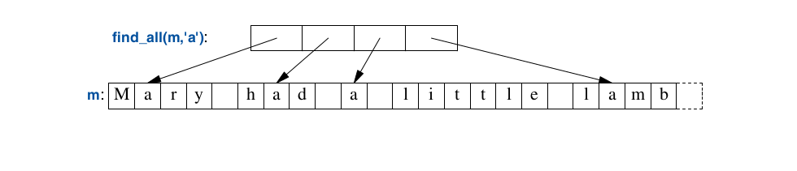
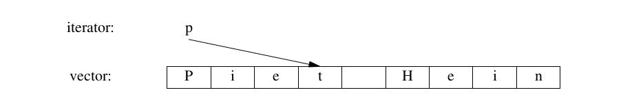
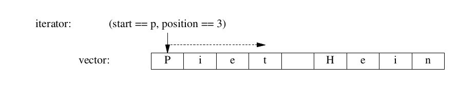
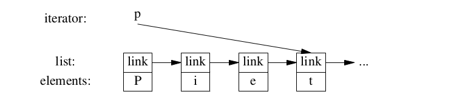
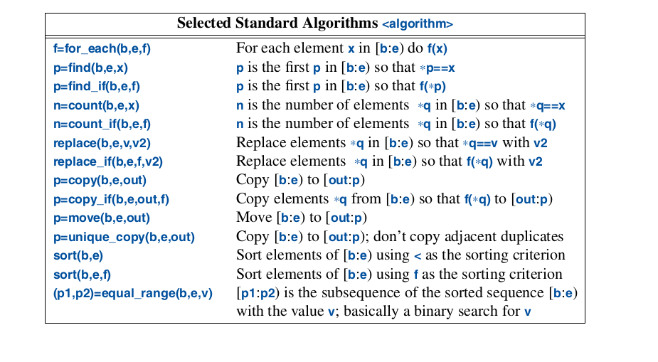
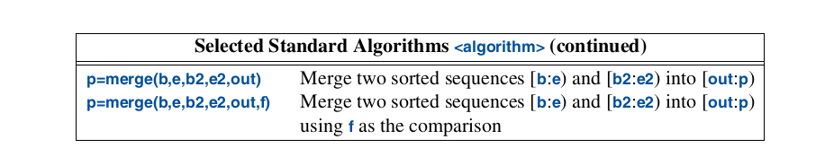

.. include:: ../../links.txt
.. include:: ../../roles.txt

.. _lec12:

.. contents:: Table of Contents
   :local:
   :depth: 1
   :backlinks: top

.. _lec_Algorithms_:

Standard Library Algorithms
#################################################

Introduction
--------------------

Now that we have access to a set of containers we needs useful operations to be able to use them.
We need to be able to access elements, add and remove elements of our containers.
Furthermore, we often need to sort our containers, print them, extract subsets, search for objects.
The standard library provides the most common algorithms for containers.  For example, the
standard library provides a sort function that can be used to sort containers of any type.

.. literalinclude:: code/sort_entry.cpp
    :language: cpp

- This first example sorts the entries in the vector and places the unique values into a list of entries.
- This works because have defined both  the :code:`<` and the :code:`==` operator for Entries.

A standard algorithm is expressed by a pair of iterators which represent the begin and the one-past-the-end of
a sequence of elements.  The sort example we sorted the elements defined by :code:`vec.begin()` and :code`vec.end()`.

When we write output we only need to specify the first element to be written.  If more than one element is written, then
the following elements will be overwritten.  To avoid errors, the :code:`list` above needs as many elements as there are
unique values is :code:`vec`.

If we wanted to place the unique elements in a new container, we could have written

.. literalinclude:: code/sort_entry2.cpp
    :language: cpp

:code:`back_inserter(res)` constructs an iterator for :code:`res` that adds the elements at the end of a container,
and extends the container to make room for the elements.

Use of Iterators
--------------------

When using containers with algorithm it is important to be comfortable with the use of iterators.
Often the input to algorithm is a pair of iterators, and the return can be an iterator as well.
For example, the standard algorithm :code:`find` looks for a value in a sequence and returns
an iterator to the element if it is found.

.. literalinclude:: code/find.cpp
    :language: cpp

As you can see, :code:`find` return :code:`end()` if the element was not found.

Lets now try a more interesting example, lets find all the occurrences of a character in a string.

.. literalinclude:: code/find2.cpp
    :language: cpp

We iterate through the string using the conventional loop, moving the iterator :code:`p` forward one element
using the :code:`++` operator.  We access the value of the elements using the dereference operator :code:`*`.
The call of find_all() generates a result that could graphically be represented like this:

Iterators and standard algorithms work equivalently on every standard container for which their use makes
sense.  Here is an example of how to generalize the find_all function.

.. literalinclude:: code/findall1.cpp
    :language: cpp

The :code:`typename` is needed to inform the compiler that :code:`C`s :code`iterator` is supposed to be
a type and not a value of some type. We can hide this detail by introducing a type alias for :code:`iterator`.

For example,

.. literalinclude:: code/findall2.cpp
    :language: cpp

We can test the general implementation with the following code,

.. literalinclude:: code/find4.cpp
    :language: cpp

Iterator Types
--------------------

What are iterators?  Any particular iterator is an object of some type.  However, iterators also contain
extra information necessary to accomplish any particular task for a particular container type.  Iterators
are specialized for the containers they serve because the underlying representation of the containers can
vastly different.  For example, a vector's iterator could simply just be a pointer,
because a pointer allows us to refer to the elements of a vector:

A vector's iterator could also be implemented as a pointer plus an index: which allows range checking.

 A list iterator must be something more complicated than a simple pointer because an element of
a list in general does not know where the next element of that list is.  This a list, iterator
might be a pointer to a link.

What is common for all iterators is their semantics for naming and operations.  For example,

- :code:`++` applying to any iterator yields an iterator that refers to the next element.
- :code:`*` yields the element to which the iterator refers
- Any object that behaves with these few rules can be referred to as an :code:`iterator`

    - For this reason, :code:`iterator` can be referred to as a concept.
- Users rarely need to know the type of the :code:`iterator` but trust that they will behave the as usual.

Predicates
--------------------

In the examples so far the algorithms have simply "built in" the actions that will be done for each element.
However, it is possible to make the action a parameter to the algorithm.  For example, the :code:`find`
algorithm provides a convenient way of looking for a specific value.  A more general algorithm can
look for an element that fulfills a specific requirement, a **predicate**.

For example, we might want to search a map for the first value larger than :code:`42`.  A :code:`map` allows us
to access its elements as a sequence of *(key, value) pairs, so we can search a :code:`map<string,int>` sequence for
a :code:`pair<const string,int>` where :code:`int` is greater than :code:`42`.

.. literalinclude:: code/predicates.cpp
    :language: cpp

Here we use the function object :code:`Greater_than` to hold the value to be compared against.

We can also use a lambda expression to define the predicate.
- A predicate should not modify the values of the elements to which it is applied.

Algorithm Overview
--------------------

In the C++ context, an algorithm is a function template operating on a sequence of elements.
The standard library algorithms all takes sequences as inputs.  Here are few examples of the
standard library algorithms.

