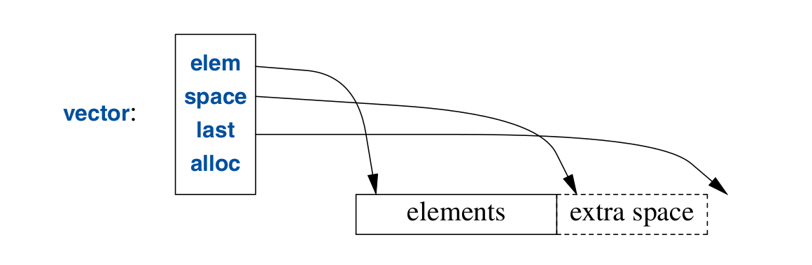

.. include:: ../../links.txt
.. include:: ../../roles.txt

.. _lec12:

.. contents:: Table of Contents
   :local:
   :depth: 1
   :backlinks: top


.. _lec6_Containers_:


Standard Library Containers and Algorithms
#################################################

std::Vector
########################

- :code:`std::vector<T>`
- Sequence of elements of a given type
- Elements are stored contiguously in memory
- Implemented by pointers

    - Point to the first element of a given type
    - Point to one-past-the-last element
    - Point to one-past-the-last allocated space
    - Also holds an allocator



- :code:`alloc` is used to acquire memory for its elements.

    - By default uses the :code:`new` and :code:`delete` operators to

We can initialize a vector with a set of values of its element type:


.. literalinclude:: code/vector_init.cpp
    :language: cpp

- each of these initializations uses the corresponding literals

Elements can be accessed through subscripting, for example

.. literalinclude:: code/vector_print.cpp
    :language: cpp

- Indexing starts at :code:`0`
- The :code:`vector` member :code`size()` gives the number of elements.

.. note::

    We rely on :code:`cout <<v[i]<<` working  for all types :code:`<T>`.
    Here is an example of defining the :code:`ostream` operator
    for the :code:`complex` class.

.. literalinclude:: code/print_complex.cc
    :language: cpp

Since the elements of a vector constitute a range, we can use a range-for loop:

.. literalinclude:: code/vector_print2.cpp
    :language: cpp

- :code:`const auto& x:v` means we are looping through the elements by const reference
- Relies on the fact that :code:`begin()` and :code`end()` is defined.

Initializing Size
_______________________

By defining a vector we are initializing the vector with an initial size.

.. literalinclude:: code/vector_size_init.cpp
    :language: cpp

- :code:`v(n)` defines a vector with size n
    - The elements will be initialized to the element type's default value
        - :code:`nullptr` for Pointers
        - :code:`0` for numbers
- :code:`v(n,val)` defines a vector with size :code:`n` and values :code:`val`

Changing Size
_______________________

- :code:`push_back()` adds a new element to the end of the vector
- This increases the size by one.


.. literalinclude:: code/vector_push_back.cpp
    :language: cpp

- Here we read :code:`int`s from file :code:`int.txt`.
- We don't initialize know how large the file will be so :code:`vector<int> is initialized with size 0`
- We read ints from the file and use :code:`push_back()` to place them in the vector.


vector<T> implementation
___________________________________

Vector is implemented so that :code:`code()` push back is efficient.
Below shows an an example implementation of :code:`Vector`.  We start with the
:code:`Vector` implementation from the templates lectures.  We omit many of the
member functions.

.. literalinclude:: code/Vector.h
    :language: cpp

- :code:`vector` has three members:

    - :code:`capacity()`
    - :code:`reserve()`
    - :code:`push_back()`


- :code:`reserve()` is used my other member functions as well as by users.

    - Makes more room for more elements
    - May have to allocate new memory

        - when it does it moves the elements to the new allocation.
- Given :code:`capacity()` and :code:`reserve()` we can implement :code:`push_back()`.


.. literalinclude:: code/VectorTpush_back.cpp
    :language: cpp

.. admonition:: Exercise: Implement New Vector<T>

    - Go to the code code/testing/VectorT.h
    - Finish the implementation of the :code:`Vector` class
    - Notice the representation is different


Range Checking
_______________________

A standard-library :code:`vector` does not guarantee range checking.
Try running

.. literalinclude:: code/vector_range_checking.cpp
    :language: cpp

- Here we are initializing :code:`int` with :code:`a[a.size()]` which is out of range.
- Instead of alerting us of a range error, we are likely to initialize :code:`int i` with a random value.
- Run the code to find out.

If we rather our vector do range checking for us, we can use a simple range checking adaptation
of vector:


    

Parameterized Types
_______________________

In the following we are going to describe how we can parameterize types.  We will
show how to parameterize our Vector of doubles class into a Vector that can hold 
any type :code:`T`.


Notice a few things:

    - first line :code:`template <typename T>` defines a template class or function

        - :code:`template<typename T>` makes T a parameter of the :code:`Vector` declaration
    - Our representation has changed

        - :code:`T* elem` 
        - We are now pointing to an array of type :code:`T`
        - :code:`int sz` remains the same.

This is C++'s version of the mathematical "for all type T".

.. note:: 
    Using :code:`class` to introduce a type parameter is equivalent to using :code:`typename`

Lets now define member functions:

.. admonition:: Example: Parameterize Vector Class Member Functions

    - Go to the code /lecture_code/templates/Vector/VectorT.cc
    - Replace representation :code:`double *` with :code:`T *`

Lets use our new parameterized Vector class.

.. admonition:: Example: Using Vector Class 

    - Go to the code /lecture_code/templates/Vector/mainVectorT.cc
    - define three different types of Vectors

        - :code:`Vector<int>`
        - :code:`Vector<double>`
        - :code:`Vector<complex>`
    - print the vectors
            
            
Using our Vector Class
````````````````````````````````

Here are some examples using our vector template class.  
The first example is using our vector to hold strings.

.. literalinclude:: /lecture_code/templates/Vector/write_string_vector.cc
    :language: cpp

Here we have two functions.  The first function returns a :code:`Vector<string>`
by passing in a string and breaking up each word in the string.

The second function prints our :code:`Vector<string>` by looping with the :code:`size()` function.    

Supporting range-for
````````````````````````````````

We can support the range-for loop by defining :code:`begin()` and :code:`end()` functions.
These functions need to point to the first element and one past the last element of our 
:code:`Vector<T>`.

.. literalinclude:: /lecture_code/templates/Vector/write_string_vector2.cc
    :language: cpp

- This example shows how we can write :code:`begin()` and :code:`end()` functions
- We declare const to insure that we only get read access.
- We can declare non-const versions of begin and end


.. admonition:: Example: Non const begin and and end functions

    - Start in `write_string_vector2.cc`
    - Write a function that changes each string in the vector to your name
    - Use range-for loops by providing necessary non-const begin and end functions
  
.. admonition:: Example: begin() and end() member functions

    - Add begin and end functions to `VectorT.h`
    - Hint: You will need to return :code:`&this`


Notes
``````````````````````````````````````````````````````````
We can define all types of generic data structures using the template syntax.
On your own you should try to implement your own version of each of these:

- lists
- vectors
- maps and unordered maps

.. note:: 
    - Templates are a compile time mechanism

        - No run time overhead
        - :code:`Vector<double>` is the same as the original :code:`Vector`
    - Template plus a set of template arguments is called an *instantiation* or *specialization*
    - You cannot separate template class definitions from declarations


.. admonition:: Exercise: HW Part 2 using Vector<T>

    - Use our new Vector type that we have define to try and create a Vector<SpherePoints>
    - Find the max and min arc distances of :code:`N` points on the Sphere
    - Start in `/Vector/sphere_point.cc`
    - You will need to rewrite the generate function


Value Template Arguments
____________________________

- Instead of **types** templates can also take **values**
- Here is an example of a Buffer of variable size

.. literalinclude:: /lecture_code/templates/buffer/buffer.cc
    :language: cpp

- Useful for creating arbitrary sized buffers on the stack
- template value arguments must be a constant expression

    - Evaluated at compile time


Parameterized Operations
____________________________

- Templates can be used to parameterize operations.
- An operation can be parameterized by a type or a value
- 3 ways to parameterize an operations

    - A function template
    - A function object: Object that carries data but is called like an object
    - A lambda expression: A shorthand notation to a function object


Function Templates
____________________________

Example: Write a function that calculates the sum of the elements of any sequence that a range for
can traverse.


