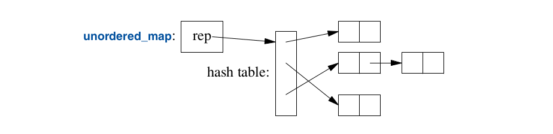

.. include:: ../../links.txt
.. include:: ../../roles.txt

.. _lec12:

.. contents:: Table of Contents
   :local:
   :depth: 1
   :backlinks: top

.. _lec6_Containers_:

Standard Library Containers and Algorithms
#################################################

std::Vector
########################

- :code:`std::vector<T>`
- Sequence of elements of a given type
- Elements are stored contiguously in memory
- Implemented by pointers

    - Point to the first element of a given type
    - Point to one-past-the-last element
    - Point to one-past-the-last allocated space
    - Also holds an allocator

- :code:`alloc` is used to acquire memory for its elements.

    - By default uses the :code:`new` and :code:`delete` operators to

We can initialize a vector with a set of values of its element type:

.. literalinclude:: code/vector_init.cpp
    :language: cpp

- each of these initializations uses the corresponding literals

Elements can be accessed through subscripting, for example

.. literalinclude:: code/vector_print.cpp
    :language: cpp

- Indexing starts at :code:`0`
- The :code:`vector` member :code`size()` gives the number of elements.

.. note::

    We rely on :code:`cout <<v[i]<<` working  for all types :code:`<T>`.
    Here is an example of defining the :code:`ostream` operator
    for the :code:`complex` class.

.. literalinclude:: code/print_complex.cc
    :language: cpp

Since the elements of a vector constitute a range, we can use a range-for loop:

.. literalinclude:: code/vector_print2.cpp
    :language: cpp

- :code:`const auto& x:v` means we are looping through the elements by const reference
- Relies on the fact that :code:`begin()` and :code`end()` is defined.

Initializing Size
_______________________

By defining a vector we are initializing the vector with an initial size.

.. literalinclude:: code/vector_size_init.cpp
    :language: cpp

- :code:`v(n)` defines a vector with size n
    - The elements will be initialized to the element type's default value
        - :code:`nullptr` for Pointers
        - :code:`0` for numbers
- :code:`v(n,val)` defines a vector with size :code:`n` and values :code:`val`

Changing Size
_______________________

- :code:`push_back()` adds a new element to the end of the vector
- This increases the size by one.

.. literalinclude:: code/vector_push_back.cpp
    :language: cpp

- Here we read :code:`int`s from file :code:`int.txt`.
- We don't initialize know how large the file will be so :code:`vector<int> is initialized with size 0`
- We read ints from the file and use :code:`push_back()` to place them in the vector.

vector<T> implementation
___________________________________

Vector is implemented so that :code:`code()` push back is efficient.
Below shows an an example implementation of :code:`Vector`.  We start with the
:code:`Vector` implementation from the templates lectures.  We omit many of the
member functions.

.. literalinclude:: code/Vector.h
    :language: cpp

- :code:`vector` has three members:

    - :code:`capacity()`
    - :code:`reserve()`
    - :code:`push_back()`

- :code:`reserve()` is used my other member functions as well as by users.

    - Makes more room for more elements
    - May have to allocate new memory

        - when it does it moves the elements to the new allocation.
- Given :code:`capacity()` and :code:`reserve()` we can implement :code:`push_back()`.

.. literalinclude:: code/VectorTpush_back.cpp
    :language: cpp

.. admonition:: Exercise: Implement New Vector<T>

    - Go to the code code/testing/VectorT.h
    - Finish the implementation of the :code:`Vector` class
    - Notice the representation is different

Range Checking
_______________________

A standard-library :code:`vector` does not guarantee range checking.
Try running

.. literalinclude:: code/vector_range_checking.cpp
    :language: cpp

- Here we are initializing :code:`int` with :code:`a[a.size()]` which is out of range.
- Instead of alerting us of a range error, we are likely to initialize :code:`int i` with a random value.
- Run the code to find out.

If we rather our vector do range checking for us, we can use a simple range checking adaptation
of vector:

.. literalinclude:: code/VectorRangeCheck.h
    :language: cpp

- :code:`Vec` inherits everything from :code:`std::vector` except the subscript operator.

- We redefine this to do range checking.
- :code:`at()` operator is a vector subscript operation that throws an exceptions exception of type :code:`out_of_range` if the argument is out of range.
- The user can catch the exception if if the user does not catch the exception then the program will just terminate.

:note:
    One way to minimize uncaught exceptions is to use a :code:`main()` with a try-block as its body. For example:

.. literalinclude:: code/range_checking_main.cpp
    :language: cpp

list
########################

The standard library offers a doubly-linked list called :code:`list`:

Lists are used for sequences where we may want to insert and delete elements
without moving other elements.

.. literalinclude:: code/list_example.cpp
    :language: cpp

The search for :code:`s` begins at the beginning of the list and proceeds until
:code:`s` is found or the end of the :code:`phone_book` is reached.

We can use an iterator to identify an element of a list and iterate.  Every standard
library container provides the :code:`begin()` and :code`end()` function.  Here
we present another way to search for the elements of the list. The

.. literalinclude:: code/list_example2.cpp
    :language: cpp

This is more or less the how the range-for loop is implemented.

Add and deleting elements
___________________________

We can add and delete elements using the :code:`insert()` and :code:`erase()`
functions.  For a list, :code:`insert(p,elem)` inserts an element with a copy of
value before the element pointed to by :code:`p`.  Here, :code:`p` may be an
iterator pointing one-beyond-the-end of the :code:`list`.  Conversely, :code:`erase(p)`
removes the element pointed to by :code:`p` and destroys it.

.. literalinclude:: code/list_example3.cpp
    :language: cpp

map
########################

The standard library offers a balanced binary search tree (usually, a red-black tree) called map:

Here is a link about `red black trees <https://www.cs.auckland.ac.nz/software/AlgAnim/red_black.html>`_

You can think of a map as a python dictionary implemented as a balanced binary search tree.

The standard library :code:`map` is a container of pairs of values optimized for lookup.  We
can use the same initializer as for :code:`vector` and :code:`list`

.. literalinclude:: code/map_example1.cpp
    :language: cpp

- We index but subscripting with a value of the first type *key*.
- If the *key* is found then it returns the corresponding value of the second type *value*.
- If a *key* isn't found using the subscript operator :code:`[]` then the key is added to the map with a default value of the second type.

.. literalinclude:: code/map_example2.cpp
    :language: cpp

We can avoid adding values to our map by passing our map by value or using the :code:`find()`.
The :code:`insert()` function can be used to insert values into our map.

The performance of a lookup is O(logn)

unorderd_map
########################

Standard library provides a standard library undorderd_map.  The unorderd_map uses a hash lookup and
therefore can provide O(1) lookup.

Like map we can subscript the elements.

.. literalinclude:: code/unordered_map_example1.cpp
    :language: cpp

The standard library provides a default hash function for :code:`strings` as well as other built-in and standard library types.
If necessary, you can provide a custom hash function for your own types.  A hash function is often provided as function object. For example,

.. literalinclude:: code/unordered_map2.cpp
    :language: cpp

Container Overview
########################

Here is a list of some of the most useful standard library containers provided.

- All the unordered containers are optimized for lookup

    - Implemented using a hash table for

`<Containers https://www.cplusplus.com/reference/stl/>`_

All of the containers are notationally similar.  Here are some of the standard container operations.

