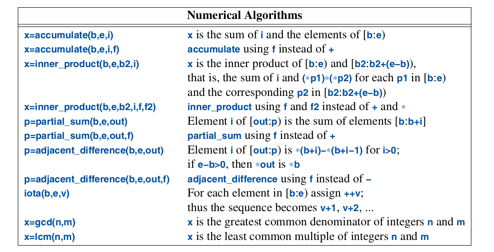

.. include:: ../../links.txt
.. include:: ../../roles.txt

.. _lec13:

.. contents:: Table of Contents
   :local:
   :depth: 1
   :backlinks: top

.. _lec_Numerics_:

Introduction
#################################################

This chapter describes the part of the standard library that supports
numerics.  I will introduce some techniques that will allow us to
perform common math operations on generic sequences.

Mathematical Functions
#################################################

.. admonition:: :code:`<cmath>`

    - Mathematical functions can be found in the :code:`<cmath>` library.
    - Functions take arguments of type
        - :code:`double`
        - :code:`float`
        - :code:`long double`
    - They take in a value of type :code:`T` and return a value of type :code:`T`.

    .. image:: images/math.png

    - The mathematical functions for :code:`complex` type can be found in :code:`<complex>`
    - :code:`<cmath>` are overloaded functions not template functions.

    Errors are reported by setting the error flag :code:`errno` from :code:`<cerrno>` to :code:`EDOM` for
    a domain error and to :code:`ERANGE` for a range error.

    **cerrno.cpp**

    .. literalinclude:: code/cerrno.cpp
        :language: cpp

Adapting Math Functions
#################################################

.. admonition:: Adapting :code:`<cmath>` functions for template functions.

    In the following example I try to write a template function that takes in a value **x** and a function
    **f** and prints out **f(x)**. The value **x** has type :code:`T` and the function **f** has type :code:`function<T(T)>`.

    .. literalinclude:: code/cmath_template1.cpp
        :language: cpp

    This code might look valid but it leads to compilation error.  What you find is that
    you can not just in put a naked math function like :code:`sin` or :code:`cos`.  The
    reason is because the math functions are overloaded therefore the compiler struggles
    to find the valid form of the function.

    Use your IDE or your compiler to try and make sense of the error.  You will find an error similar
    to :code:`no viable conversion from overload function type`

    Therefore we need to find a way to set the
    type of the function.  We can do this using a lambda function or a function objects

    **Lambda Adaptation**

    .. literalinclude:: code/cmath_template2.cpp
        :language: cpp

    Great! So we can adapt any of the std::math functions to work in our template print functions.

    **Practice**

    1. Use a lambda function to adapt the log function that takes in a :code:`long long double`
    2. Do the same using a function object.

    ** Review template specialization**

    Notice when calling the function with a :code:`complex<double>`:
    the output gives us.

    .. code-block:: console

        f(2) = 0.909297 : sin(x)
        f((2,3)) = (9.1545,-4.16891) : sin(x)

    Let's try to specialize the template function to remove the extra parentheses when we call
    the function with a :code:`complex<double>`. That way the output remains consistent.

    .. code-block:: console

        f(2) = 0.909297 : sin(x)((2,3))
        f(2,3) = (9.1545,-4.16891) : sin(x)

    **Template specialization**

    We can specialize the template function to remove the extra parentheses using the
    :code:`template<>` notation.

    .. literalinclude:: code/cmath_template3.cpp
        :language: cpp

    - The :code:`using complex_double=complex<double>` helps us simplify notation.

    **Practice**

    1. Specialize the print function for a string function

Numerical Algorithms
#################################################

In :code:`<numeric>` we can find a set of generalized numerical algorithms, such as :code:`accumulate()`

Accumulate and Generate
#################################################

.. admonition:: Accumulate

    .. code-block:: cpp

        x=accumulate(b,e,i);

    - **x** is the sum of **i** and the elements of :code:`[b:e)`
    - Takes the sum of a sequence from :code:`iterator` **b** to :code:`iterator` **e**

     For example the next example,
    takes the sum from -pi/2 to pi/2:

    **accumulate.cpp**

    .. literalinclude:: code/accumulate.cpp
        :language: cpp

    The linspace function is implemented using the standard algorithm :code:`generate`.
    Generate assigns the value of each element to the value returned by the generator.

    - The signature of the generator **g** must be :code:`Ret g();` where :code:`Ret` is the same type as the value type of the iterator.
    - `Generator reference <https://en.cppreference.com/w/cpp/algorithm/generate>`_
    - Finally we use accumulate to compute the sum of each value in the range.

    **Adding a function f to accumulate**

    Instead of addition we can define the binary operation that can be applied to the
    the sequence of elements

    .. code-block:: cpp

        x=accumulate(b,e,i,f);

    - **f** replaces the :code:`+` operator.
    - **f** must must be a binary operator
    - For more information on how to use accumulate you should check the `cppreference <https://en.cppreference.com/w/cpp/algorithm/accumulate>`_

    In this example I show a way to integrate a function using the Riemann's sum by adding a lambda
    function into accumulate.  Notice the form of the function.  Accumulate expects the function to
    input two values. The first value will be the current sum and the second is what is added.

    .. literalinclude:: code/accumulate2.cpp
        :language: cpp

    **Practice**

    1. Try integrate different function's by modifying the lambda function.

Inner Product and Transform
#################################################

.. admonition:: inner_product

    .. code-block:: cpp

        x=inner_product(b,e,b2,i);

    - **x** is the inner product between two sequences starting at **b** and **b2**.

    **inner_product.cpp**

    - In this example we take the inner product between sin(x) and cos(x) in the range between -pi/2 and pi/2

    .. literalinclude:: code/inner_product.cpp
        :language: cpp

    - I use the :code:`transform` algorithm to compute the vectors holding sin(x) and cos(x)
    - The transform function can work two ways either transforming
        - Works in a unary way applying a function to a single sequence and returning the output
            - The function it applies is unary operator like :code:`y=f(x)`
        - Works in a binary way applying a function to a two sequences and returning the output
            - The function it applies is unary operator like :code:`y=f(x0,x1)`
    - `transform <https://en.cppreference.com/w/cpp/algorithm/transform>`_
    - We use inner_product to compute the inner_product between the elements.

    **Modifying inner_product**

    The standard inner_product is defined by two operations: addition :code:`+` and :code:`*`.  We can modifying
    each of these in order to define our own inner products.  In the following example I modify
    the inner product in order to take the integral of a product of sequences defined on same grid.

    **inner_product2.cpp**

    .. literalinclude:: code/inner_product2.cpp
        :language: cpp

    - The first two inner_products I multiply the two sequences using :code:`std::multiplies()`.
    - The last inner_product I add the sequences to compute sin(x)^2+cos(x)^2 using :code:`std::plus()`

Adjacent_difference and partial_sum
#################################################

.. admonition:: Adjacent difference and Partial Sum

    **adjacent_difference**

    .. code-block:: cpp

        x=adjacent_difference(b,e,out);

    - computes the adjacent difference between the elements of a sequence and places result in an output sequence.
    - `adjacent_difference <https://en.cppreference.com/w/cpp/algorithm/adjacent_difference>`_

    **adjacent_difference.cpp**

    .. literalinclude:: code/adjacent_difference.cpp
        :language: cpp

    **partial_sum**

    .. code-block:: cpp

        x=partial_sum(b,e,out);

    - computes the partial_sum between the elements of a sequence and places result in an output sequence.
    - `partial_sum <https://en.cppreference.com/w/cpp/algorithm/partial_sum>`_

    **partial_sum.cpp**

    .. literalinclude:: code/partial_sum.cpp
        :language: cpp

    **Modification**

    Adjacent_difference and partial_sum are very similar in that they both save the
    the output of a binary operator into an output container.  The difference is
    in the form of the input.  The partial_sums accumulates the values while adjacent_difference
    applies the operator to the input sequence only.

    **partial_sum_vs_adjacent_difference.cpp**

    .. literalinclude:: code/partial_sum_vs_adjacent_difference.cpp
        :language: cpp

    Having this in mind we can alter the binary operation in either the partial sum or adjacent_difference function.

Generic Finite Difference Function
#################################################

.. admonition::  Finite difference

    - In the following example we create a finite difference function by modifying the adjacent_difference function.
    - The finite difference equation takes in a sequence :code:`C` and returns a sequence.
    - It also takes in a function of type :code:`std::function<Value_type<C>(Value_type<C>)>` which acts on each element.

    **finite_difference.cpp**

    .. literalinclude:: code/finite_difference.cpp
        :language: cpp

    **Practice**

    1. Modify the partial_sum function to write a cumulative integral function.

