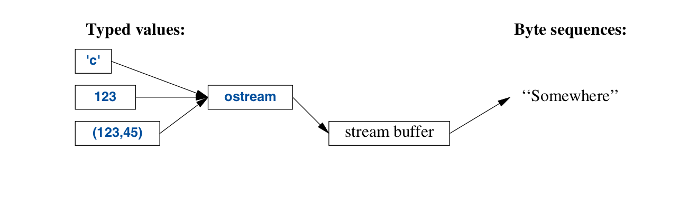
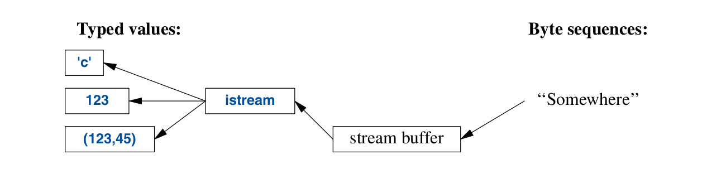

.. include:: ../../links.txt
.. include:: ../../roles.txt

.. _lec13:

.. contents:: Table of Contents
   :local:
   :depth: 1
   :backlinks: top

.. _lec_Input_Output_:

Input/Output
#################################################

Introduction
#################################################

I/O stream library provides formatted and unformatted buffered input and
output of text and numeric values.

An :code:`ostream` converts typed objects to a stream of characters (bytes):

An :code:`istream` converts a stream of characters (bytes) into typed objects:

Output
###########

The :code:`<ostream>` stream library defines the I/O for every built-in type.

We can also define the output of any user-defined type.  The operator :code:`<<` is used
as an output operator on objects of type :code:`ostream`;  :code:`cout` is the standard
output stream and :code`cerr` is the standard stream that reports errors.

Input
###########

The :code:`<istream>` header defines the :code:`istream` objects that can be used for input.
Input stream objects work with sequences for characters which represent built-in types.

Input streams can also be extended to work with user-defined types.

The operator :code:`>>` is used as an input operator;  :code:`cin` is the standard input stream.
The type of the right-hand operand of :code:`>>` determines what input is accepted and what is the target
of the input operation. For example:

.. code-block:: cpp

    void f(){

        int i;
        cin>>i; // reads an integer into i

        double d;
        cin>> d; // reads a double-precision floating-point number into d
    }

- Reads 1234, from the standard input into the integer variable :code:`i`
- Reads floating-point number, such as 12.345e5, into a double variable :code:`d`

.. code-block:: cpp

    void f(){
        int i;
        double d;
        cin>>i>>d;
    }

- The read of the integer is terminated by anything that is not a digit.
- By default :code:`>>` skips initial whitespace so we code input like,

.. code-block:: console

    1234
    12.34e5

Reading Characters
#####################

A convenient way to read in sequence of characters is to read into a :code:`string`
For example:

.. code-block:: cpp

    void hello(){
        cout<<"Please enter your name \n";
        string str;
        cin >>str;
        cout<<"Hello, " << str<<"!\n";
    }

If you type in :code:`Mary` the response is:

.. code-block:: console

    Hello, Mary!

By default, a white space character will terminate the read.  Therefore if
you wanted to enter :code:`Mary John` the response is still:

.. code-block:: console

    Hello, Mary!

To read an entire line you can use the :code:`getline()` function.  For example:

.. code-block:: cpp

    void hello_line(){

        cout <<"Please enter your name \n";
        string str;
        getline(cin,str);// pass in istream and string
        cout<<"Hello, " <<str<<"!\n";
    }

This code will correctly return the desired output:

.. code-block:: console

    Hello, Mary John!

Input Output State
############################

An :code:`iostream` object has a state that determines whether an operation succeeded.
The most common use is the read a sequence of values:

.. literalinclude:: code/read_ints.cpp
    :language: cpp

This reads from :code:`is` until something that is not an integer is encountered.
That something is usually the end of input.

What is happening here is that the operation :code:`is>>` returns a reference to
:code:`is`, and testing an :code:`iostream` yields :code:`true if the stream is
ready for another operation.

In general, the I/O state holds all the information needed to read or write, such as formatting
information, error state, and what kind of buffering is used.  In particular
the user can set the state to indicate that an error has occurred and clear the state
if the error is not serious.  For example, we could imagine a version of read_ints that
accepted a terminating string:

.. literalinclude:: code/read_ints2.cpp
    :language: cpp

I/O of User defined types
############################

We can defined the input and output of user defined types by overloading the appropriate operators.

For example, we can consider a simple type :code:`Entry` that we might use to represent
entires in a phone book.

.. code-block:: cpp

    struct Entry{
        sting name;
        int number;
    };

We can define a simple output operator to write an :code:`Entry` format {"name",number} similar to the one
we use for initialization in code:

.. literalinclude:: code/writeEntry.cpp
    :language: cpp

A user-define output operator takes its output stream (by reference) as the first
argument and returns it as its result.

The corresponding input is a bit more complicated because it needs to be
checked for correct formatting and deal with errors:

.. literalinclude:: code/readEntry.cpp
    :language: cpp

File Streams
############################

:code:`<fstream>` that provides stream objects which read and write to and from files.

    - :code:`ifstream` is for reading form a file
    - :code:`ofstream` if for writing to a file
    - :code:`fstream` is for reading and writing to a file

For example

.. code-block:: cpp

    ofstream ofs{"target"};
    if(!ofs)
        error("couldn't open 'source' for reading");

Testing that a file stream has been properly open is usually done by
testing the state

.. code-block:: cpp

    ifstream ifs{"source"};
    if(!ifs)
        error("couldn't open 'source' for reading");

Assuming that the tests succeeded, :code:`ofs` can be used as an ordinary :code:`ostream` (just like cout)
and :code:`ifs` can be used as an ordinary :code:`ifstream`

Exercises
*************************

1. Overload the :code:`<<` operator write vector of elements  of type :code:`T`

2. Write a function that returns a :code:`vector<Entry>` by reading the in entries
from an input stream.  the function signature should be

.. code-block:: cpp

    vector<Entry> readEntries(istream &is)

3. Write a function the writes a vector of entries to a file
4. Write a function that reads a vector of entries from a file

